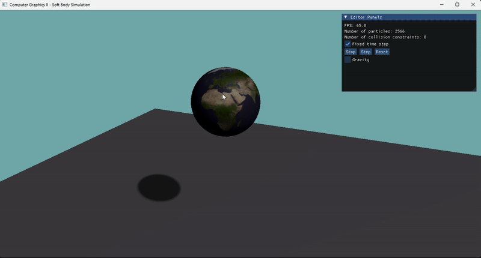
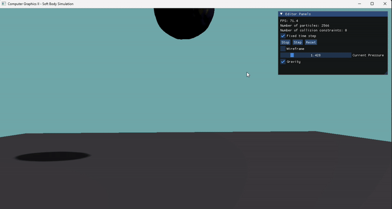

> This project is the final output of the **Computer Graphics II** module on physics simulation carried out at **Keymiung University in Korea (2025)**.
> The demonstration is on [Youtube](https://youtu.be/MZiMaxaqmEo).

# 💡 Soft Body Simulations - HXPBD Engine

This document explains how to interact with the simulations and what each `MainX.cpp` file does.

---

## 🕹️ User Interaction

- **Selection & Movement:**
  - Hold **LEFT_SHIFT** and **LEFT_CLICK** on an object to select it.
  - Once selected, move your mouse to drag the object in real-time.

- **Pressure & Wireframe:**
  - **Pressure** can only be modified on **closed objects** (e.g., cube, sphere...).
  - You must **select the object** before editing its pressure.
  - **Wireframe mode** allows you to see only the **vertices** instead of the full textured shape.

---

## 🎥 Camera Controls

- **Translate (left/right):**  
  - Hold **Left Click** and move your mouse horizontally.

- **Rotate the scene:**  
  - Hold **LEFT_CONTROL** + **Left Click**, then move the mouse.

- **Zoom In/Out:**  
  - Use the **mouse wheel**.

---

## 🧪 Simulation Files (`Main*.cpp`)

| File        | Description |
|-------------|-------------|
| **Main.cpp**   | **Empty simulation**. A clean template to create or test your own custom scenes. |
| **Main1.cpp**  | **Sphere simulation**. <br/> You can: <br/> – Enable/disable **gravity** <br/> – Drag the sphere with the mouse <br/> – Change its **internal pressure** in real-time. |
| **Main2.cpp**  | Interactive **cloth simulation**. <br/> You can grab points of the cloth and observe soft-body deformations. |
| **Main3.cpp**  | Same as `Main2.cpp`, but the cloth is **anchored** at its four corners using **FixedConstraints**, limiting edge motion. |

---

## 📌 Notes

- Objects must be properly **selected** before interacting with their properties.
- The simulation uses an **XPBD-based** constraint solver for realistic soft-body behavior.
- PBR materials are used to provide physically-based rendering with lighting and shadows.

---

## 🔧 Adding Your Own Scene

To create your own setup, duplicate `Main.cpp`, rename it (e.g., `Main4.cpp`), and use the `SceneFactory` helpers:
```cpp
SceneFactory::CreateCarpet(...);
SceneFactory::CreateSphere(...);
```

## 🧱 Compilation

In the `CMakeLists.txt`, you will find this:

```txt
# Change the main file to run different simulations
# Main.cpp  => Empty template for free sandbox using my engine.
# Main1.cpp => Simulation 1 using my engine.
# Main2.cpp => Simulation 2 using my engine.
# Main3.cpp => Simulation 3 using my engine.
Main1.cpp
```

To change the simulation, or just the hand of a project, simply change the line containing `Main1.cpp` to `Main2.cpp` or `YourMain.cpp`.

## 🎬 Simulation Results

### Main1.cpp - Sphere Simulation




### Main2.cpp - Free Cloth Simulation


### Main3.cpp - Anchored Cloth Simulation


